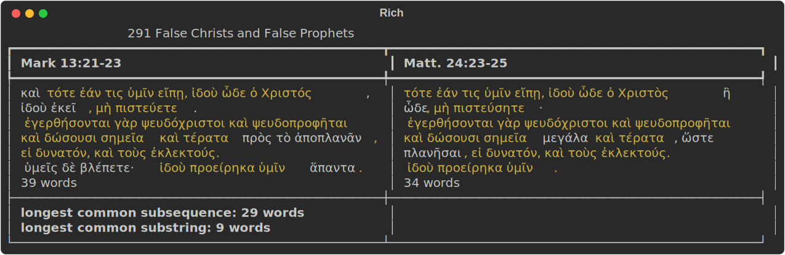

# Find Agreement

Find Agreement is a proof of concept for automating the research and study of the [Synoptic Problem](https://virtualreligion.net/primer/synoptic.html) in Python, using natural language processing (NLP) of Ancient Greek. For example, where do the words of the gospel of Mark and the gospel of Matthew agree verbatim? If the writer of the gospel of Matthew used the gospel of Mark as a source, what words did the writer add? And how was the Hebrew Bible quoted?

This may eventually permit additional [statistical study](https://www.jstor.org/stable/1560364) of the [written sources of the Gospels](https://scholarlypublishingcollective.org/sblpress/jbl/article-abstract/133/4/793/179158/A-Flaw-in-McIver-and-Carroll-s-Experiments-to?redirectedFrom=fulltext). Or it may permit creating graphs of strings of verbatim agreement (see Alan Garrow's videos on "[Streeter's 'Other' Synoptic Solution:  The Matthew Conflator Hypothesis](https://www.alangarrow.com/mch.html/)" for examples).

Typically [parallels between the Gospels](https://www.gospelparallels.com) are selected from a [list](https://www.bible-researcher.com/parallels.html), [synchrony](https://www.historyinthebible.com/supplementary_pages/gospel_synchronicity.html), or [parallel](http://www.hypotyposeis.org/synoptic-problem/2004/09/parallel-synoptic-table.html) [table](http://www.iaua.name/Parallel.html). Individual sayings, parables or actions of Jesus are called **pericope**; [some are repeated in more than one Gospel](http://www.semanticbible.com/cgi/2004/11/pericope-index.html). A case study (e.g., of the [Baptism of Christ](https://nearemmaus.wordpress.com/wp-content/uploads/2011/09/leport-triple-tradition-material.pdf)) can select three passages, one from each Synoptic Gospel, and compare the wording for agreement.

## Example

An example is the first verses of [pericope 291](https://www.bible-researcher.com/parallels3.html) "[False Christs and False Prophets](http://www.semanticbible.com/cgi/2004/11/Pericope.270.xml)" in Mark and Matthew. These looks similar in the [New American Standard Bible](https://www.lockman.org/new-american-standard-bible-nasb/):

| [Mark 13:21](https://www.biblegateway.com/passage/?search=Mark+13%3A21&version=NASB1995) | [Matthew 24:23](https://www.biblegateway.com/passage/?search=Matthew+24%3A23&version=NASB1995) |
| ------------------------------------------------------------ | ------------------------------------------------------------ |
| And then if anyone says to you, ‘Behold, here is the Christ’; or, ‘Behold, *He is* there’; do not believe *him*; | Then if anyone says to you, ‘Behold, here is the Christ,’ or ‘There *He is*,’ do not believe *him*. |

This similarity is also visible in the [1904 Patriarchal Greek New Testament](https://github.com/wldeh/bible-api/blob/main/bibles/grc-byz1904/grc-byz1904.json):

| [καταμαρκον 13:21](https://github.com/wldeh/bible-api/blob/main/bibles/grc-byz1904/books/καταμαρκον/chapters/13/verses/21.json) | [καταματθαιον 24:23](https://github.com/wldeh/bible-api/blob/main/bibles/grc-byz1904/books/καταματθαιον/chapters/24/verses/23.json) |
| ------------------------------------------------------------ | ------------------------------------------------------------ |
| καὶ τότε ἐάν τις ὑμῖν εἴπῃ, ἰδοὺ ὧδε ὁ Χριστός, ἰδοὺ ἐκεῖ, μὴ πιστεύετε. | τότε ἐάν τις ὑμῖν εἴπῃ, ἰδοὺ ὧδε ὁ Χριστὸς ἢ ὧδε, μὴ πιστεύσητε· |

Within the same text, there is little [orthographic variation](https://wiki.digitalclassicist.org/Morphological_parsing_or_lemmatising_Greek_and_Latin#Orthographic_Variation). There is different punctuation ('.' versus '·') which can be identified while assigning part of speech.

However, there are different inflected forms: Χριστός versus Χριστὸς, and πιστεύσητε versus πιστεύετε. Finding agreement consequently requires [lemmatisation](https://wiki.digitalclassicist.org/Morphological_parsing_or_lemmatising_Greek_and_Latin#Lemmatisation_and_morphological_analysis) to find the lemmata of each passage: χριστός for Χριστὸς, and πιστεύω for πιστεύσητε and πιστεύετε. A sequence matcher can then find contiguous matching subsequences:

| [καταμαρκον 13:21](https://github.com/wldeh/bible-api/blob/main/bibles/grc-byz1904/books/καταμαρκον/chapters/13/verses/21.json) | [καταματθαιον 24:23](https://github.com/wldeh/bible-api/blob/main/bibles/grc-byz1904/books/καταματθαιον/chapters/24/verses/23.json) |
| ------------------------------------------------------------ | ------------------------------------------------------------ |
| καί                                                          |                                                              |
| τότε                                                         | τότε                                                         |
| ἐάν                                                          | ἐάν                                                          |
| τὶς                                                          | τὶς                                                          |
| ὑμεῖς                                                        | ὑμεῖς                                                        |
| εἶπον                                                        | εἶπον                                                        |
| ,                                                            | ,                                                            |
| ἰδοὺ                                                         | ἰδοὺ                                                         |
| ὧδε                                                          | ὧδε                                                          |
| ὁ                                                            | ὁ                                                            |
| χριστός                                                      | χριστός                                                      |
|                                                              | ἤ                                                            |
|                                                              | ὧδε                                                          |
| ,                                                            | ,                                                            |
| ἰδοὺ                                                         |                                                              |
| ἐκεῖ                                                         |                                                              |
| ,                                                            |                                                              |
| μή                                                           | μή                                                           |
| πιστεύω                                                      | πιστεύω                                                      |
| .                                                            |                                                              |
|                                                              | ·                                                            |

Table output can then highlight these contiguous matching subsequences:



## Dependencies

This prototype uses the following libraries:

* [Pandas](https://pandas.pydata.org) to test data apart from display, and
* [Rich](https://github.com/Textualize/rich) to create the rich text (with color and style) in tables for synopses (see for example [John's Imprisonment](http://www.hypotyposeis.org/synoptic-problem/2004/10/johns-imprisonment.html) created by Stephen C. Carlson).

It also uses several libraries for analysis:

* [Bible API](https://github.com/wldeh/bible-api) for free unlimited access to 200+ versions, including the New Testament in Ancient Greek; and
* [Classical Language Toolkit](https://aclanthology.org/2021.acl-demo.3/), from which [NLP is imported to process text](https://docs.cltk.org/en/latest/quickstart.html) with [a general-purpose NLP pipeline for Ancient Greek](https://aclanthology.org/2023.latechclfl-1.14/).

Note that the [Classical Language Toolkit currently supports Python versions 3.7, 3.8, 3.9](https://docs.cltk.org/en/latest/installation.html).

A detailed list is in [requirements](requirements.txt) and may be installed into a virtual environment as usual:

```python
pip install -r requirements.txt
```

Or they may be installed individually:

```python
pip install pandas
pip install rich
pip install cltk
pip install grc_odycy_joint_sm@https://huggingface.co/chcaa/grc_odycy_joint_sm/resolve/main/grc_odycy_joint_sm-any-py3-none-any.whl
```

### Macs

Note that [urllib3>=2.0 does not work with system Python on macOS](https://github.com/urllib3/urllib3/issues/3020). Also, on M1 Macs, [thinc-apple-ops is up to eight times faster](https://github.com/explosion/thinc-apple-ops):

```python
pip install 'spacy[apple]==3.7.4'
```

## Licensing

Find Agreement is available under the [MIT License](LICENSE).

## Backlog

### Themes

| Theme     | Description                                                  |
| --------- | ------------------------------------------------------------ |
| CPD       | Explore tools for copy-paste detection.                      |
| Display   | Enhance display.                                             |
| Interface | Improve user interface.                                      |
| Refactor  | Refactor code.                                               |
| Span      | Expand from a single verse to passages within a chapter to chapters to passages across chapters. |

### Backlog Items

| Priority | Theme     | Backlog Item                                                 | Status | Score |
| -------- | --------- | ------------------------------------------------------------ | ------ | ----- |
|          | Span      | Expand from a single verse to passages within a chapter.     |        |       |
|          | CPD       | Does [spaCy](https://spacy.io) have capability to detect copy-paste? It can calculate a similarity score (cosine similarity by default) for [Doc](https://spacy.io/api/doc#similarity) and [Span](https://spacy.io/api/span#similarity). |        |       |
|          | Display   | Permit color selection for agreement.                        |        |       |
|          | Display   | Add a third column.                                          |        |       |
|          | CPD       | [Similarity measures could be calculated in Python](https://medium.com/@heerambavi/simple-plagiarism-detection-using-nlp-1ee60c4f1d48), including [Jaccard index](https://en.wikipedia.org/wiki/Jaccard_index) and [longest common subsequence](https://en.wikipedia.org/wiki/Longest_common_subsequence). |        |       |
|          | Interface | Make [runnable from command line](https://medium.com/@evaGachirwa/running-python-script-with-arguments-in-the-command-line-93dfa5f10eff). |        |       |
|          | Interface | Add example to [JupyterLab](https://github.com/jupyterlab/jupyterlab-desktop/blob/master/cli.md). |        |       |
|          | CPD       | [CPD](https://pmd.github.io/pmd/pmd_userdocs_cpd.html) [works with tokens](https://pmd.github.io/pmd/pmd_devdocs_major_adding_new_cpd_language.html) created by a [lexer](https://docs.pmd-code.org/apidocs/pmd-core/7.4.0-SNAPSHOT/net/sourceforge/pmd/cpd/CpdLexer.html#), and so may be able to work with [lemmata](https://docs.cltk.org/en/latest/cltk.core.html#cltk.core.data_types.Doc.lemmata) by [adding a new language](https://pmd.github.io/pmd/pmd_devdocs_major_adding_new_cpd_language.html), if they can be passed from Python to Java and back. |        |       |
|          | Refactor  | What else belongs in [setup.py](https://github.com/navdeep-G/samplemod/blob/master/setup.py)? |        |       |
|          | Refactor  | Add [type hints](https://docs.python.org/3/library/typing.html) and run [mypy](https://mypy-lang.org). |        |       |
|          | Refactor  | Consider complexity tools beyond mccabe, e.g., [radon](https://pypi.org/project/radon/). |        |       |
|          | Refactor  | Fix [difflib](https://docs.python.org/3/library/difflib.html) use: “The last triple is a dummy, and has the value (len(a), len(b), 0).” | FIXED  |       |
|          | Display   | Show count of words in common versus words, and [longest common substring](https://en.wikipedia.org/wiki/Longest_common_substring). | DONE   |       |
|          | Refactor  | Find linter [that works in VS Code](https://code.visualstudio.com/docs/python/linting) to check style against [PEP 8](https://peps.python.org/pep-0008/): e.g., [flake8](https://flake8.pycqa.org/en/latest/) (which includes [mccabe](https://pypi.org/project/mccabe/) and [pycodestyle](https://pypi.org/project/pycodestyle/)) or [pylint](https://www.pylint.org). Does [prospector](https://pypi.org/project/prospector/) work? | DONE   |       |
